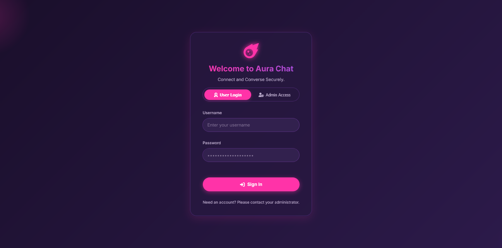

<p align="center">

  <h1 align="center">✨ Aura Chat 🔮</h1>
</p>

<p align="center">
Connect, Converse, Captivate! Aura Chat bathes your real-time communication in a mesmerizing purple and pink gradient, offering a secure and delightful chatting experience.
</p>

<p align="center">
  
  
  
  
  
</p>

<br/>
<p align="center">
  </img>
</p>

---

## 🚀 What is Aura Chat? 🤔

Aura Chat is your personal, self-hostable real-time messaging sanctuary, built to run blazing fast on Cloudflare Workers! ⚡️ It's designed for secure 1-on-1 conversations, wrapped in an enchanting purple and pink "Aura" theme that's both modern and easy on the eyes. With robust user authentication 🔑, a comprehensive admin dashboard 📊, and all the essential chat features, Aura Chat makes connecting with others a truly magical experience.

The UI is intuitive, adapting beautifully to light and dark modes 🌓, and is fully responsive for a seamless experience across all your devices 💻📱.

---

## ✨ Key Features 🌟

- **⚡️ Blazing Fast Real-time Messaging:** Instant message delivery powered by WebSockets on the Cloudflare edge. Feel the speed! 💨
- **💬 Secure 1-on-1 Chats:** Connect privately with other users. Your conversations, your space. 🤫
- **🎨 Vibrant "Aura" UI:** A stunning interface with purple and pink gradients that make chatting a visual delight. It's not just chat, it's an _aura_! 💜💖
- **🌓 Adaptive Light/Dark Mode:** Switches themes based on your system preference or with a manual toggle. Perfect for day ☀️ or night 🌙.
- **📱 Fully Responsive Design:** Looks and works great on desktops, tablets, and mobile phones. Includes a sleek slide-out panel for conversations on mobile! ➡️
- **🔐 Robust Authentication:** Secure user login and session management with JWTs. Your identity is safe! 🛡️
- **👑 Admin Aura Panel:** For the all-seeing administrator! 💪
  - Monitor system statistics (total users, messages, active users). 📈
  - Manage user accounts (add new users, delete existing ones). 🧑‍💼
  - Exclusive admin login via a secure Master Password. 🗝️
- **🟢 Online Presence Indicators:** Instantly see who's online and available to chat! ✅
- **✍️ Typing Indicators:** Know when your chat partner is typing a reply. The suspense! 👀
- **🚫 User Blocking:** Maintain your peace by easily blocking and managing users. Serenity now! 🧘
- **✏️ Message Editing & ↩️ Replying:** Made a typo? No problem! Edit your sent messages or reply directly to a specific message to maintain context.
- **🗑️ Message Deletion:** Sent something you regret? Users can delete their own messages. Poof! 💨
- **📜 Older Message Loading:** Scroll up to automatically load older messages in the conversation history.

---

## 🛠️ Tech Stack & Magic Spells 🧙‍♀️🧱

- **Frontend 🎨:**
  - HTML5 & CSS3 (with CSS Variables for theming) 💅
  - **Vanilla JavaScript (ES Modules):** A clean, modular, and framework-free front end for maximum performance! 🍦
- **Backend & Platform ☁️:**
  - **Cloudflare Workers:** Serverless functions for the backend logic. 🚀
  - **Cloudflare D1:** A serverless SQL database for all your chat data. 💾
  - **Cloudflare KV:** A key-value store, perfect for configuration or session data. 🔑
  - **WebSockets:** For real-time, bi-directional communication. 🕸️
  - **JOSE Library:** For secure JWT signing and verification. 🛡️
- **Tooling 🤠:**
  - **Wrangler CLI:** For developing, deploying, and managing your app.
  - **Node.js & npm:** For managing dependencies and running scripts. 📦
  - **`@cloudflare/kv-asset-handler`:** For efficiently serving the static site.

---

## ⚙️ Unleash the Aura: Your Setup Quest! 🗺️✨

Ready to get your own Aura Chat instance running? Follow this magical quest!

### Your Adventurer's Pack (Prerequisites) 🎒

- A **Cloudflare Account**.
- **Node.js** (LTS version) and **npm** installed on your machine.
- **Wrangler CLI** installed globally: `npm install -g wrangler`.
- You've logged into Wrangler: `wrangler login`.

### The Steps of Incantation ✨

1.  **Clone the Ancient Scrolls 📜**
    Open your terminal and clone the repository.

    ```bash
    git clone https://github.com/Md-Siam-Mia-Man/AuraChat.git
    cd AuraChat
    ```

2.  **Install Magical Dependencies 🪄**
    This command reads `package.json` and installs the necessary tools.

    ```bash
    npm install
    ```

3.  **Summon Your D1 Database 💎**
    Create the database on Cloudflare where all your messages and user data will live.

    ```bash
    npx wrangler d1 create aurachat-db
    ```

    Wrangler will give you a `database_id`. **Copy this ID!**

4.  **Create the KV Grimoire 📖**
    Now, create the Key-Value storage namespace.

    ```bash
    npx wrangler kv:namespace create aurachat-kv
    ```

    Wrangler will output an `id` for the KV namespace. **Copy this ID too!**

5.  **Enchant `wrangler.jsonc` 🔮**
    Open the `wrangler.jsonc` file and paste both of your copied IDs into their respective sections.

    ```jsonc
    // wrangler.jsonc
    "d1_databases": [
        {
            "binding": "DB",
            "database_name": "aurachat-db",
            "database_id": "YOUR_D1_DATABASE_ID_HERE" // 👈 PASTE D1 ID HERE!
        }
    ],
    "kv_namespaces": [
        {
            "binding": "aurachat-kv",
            "id": "YOUR_KV_NAMESPACE_ID_HERE" // 👈 PASTE KV ID HERE!
        }
    ],
    ```

6.  **Secure Your Secret Spell (`.dev.vars`) 🤫**
    Create a new file named `.dev.vars` in the root of your project for local secrets.

    ```ini
    # .dev.vars
    JWT_SECRET="your-super-secret-and-long-jwt-key-that-is-at-least-32-characters"
    ```

    Need a strong secret? Run this command in your terminal and copy the output:

    ```bash
    node -e "console.log(require('crypto').randomBytes(64).toString('base64'))"
    ```

7.  **Carve the Runes (Apply Schema) ✍️**
    This command sets up all the necessary tables in your D1 database.

    ```bash
    npx wrangler d1 execute aurachat-db --file ./schema.sql --remote
    ```

8.  **Ignite the Local Portal! 🔥**
    You're ready! Start the local development server.
    ```bash
    npx wrangler dev
    ```
    Aura Chat is now running locally! Open your browser to `http://127.0.0.1:8787`.

### The Admin's Ascension 👑

On your very first visit, the app will guide you through the **Admin Account Setup**. You'll create your admin user and a **Master Password**. This special password is your key to the Admin Panel, so keep it somewhere safe! 🗝️

---

## 📚 The Spellbook: Quick Commands 📜

```bash
# Generate a secure, random JWT secret
node -e "console.log(require('crypto').randomBytes(64).toString('base64'))"

# Apply schema to the LOCAL database (for testing)
npx wrangler d1 execute aurachat-db --file ./schema.sql --local

# Apply schema to the REMOTE (production) database
npx wrangler d1 execute aurachat-db --file ./schema.sql --remote

# Start the local development server
npx wrangler dev

# Deploy AuraChat to the Cloudflare network
npx wrangler deploy
```

_After deploying, remember to set your production secret with `npx wrangler secret put JWT_SECRET`._

---

## 🚀 Usage Guide 🗺️

1.  **Enter the Aura:**
    - **User Login:** Use credentials created for you by an administrator.
    - **Admin Login:** Click "Admin Access", enter the **Master Password**, and unlock the Admin Panel!
2.  **Chat Away:** 💬
    - The left panel shows available users and active conversations. Click any to begin.
3.  **Master Your Messages:**
    - **Hover** (or tap on mobile) on a message to reveal action buttons:
      - ↩️ **Reply:** Quote a message in your response.
      - ✏️ **Edit:** (Your messages only) Modify what you said.
      - 🗑️ **Delete:** (Your messages only) Make it disappear.

---

## 🤝 Contributing - Join the Aura Circle! 🙌

Got an idea to make Aura Chat even more magical? Contributions are welcome!

1.  **Fork** the repository 🍴
2.  Create your enchanting new **branch** (`git checkout -b feature/your-sparkling-idea`) 🌱
3.  Weave your coding magic 👨‍💻
4.  **Commit** your spells (`git commit -m 'Add ✨ new sparkling feature'`) 💾
5.  **Push** to your branch (`git push origin feature/your-sparkling-idea`) ⬆️
6.  Open a **Pull Request** and share your brilliance 🙏.

---

### ✨ May your conversations be vibrant with Aura Chat! 🔮🚀
